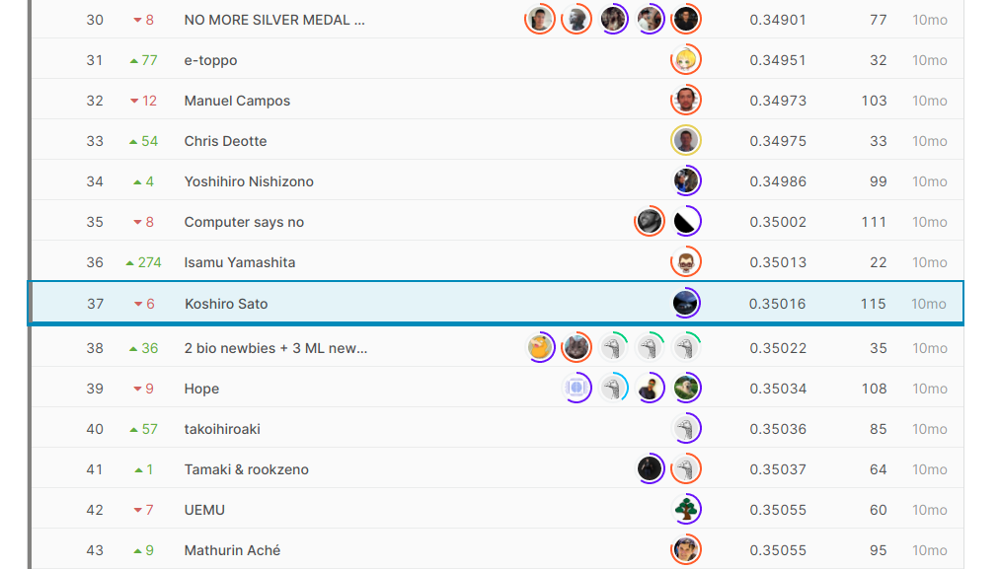

# OpenVaccine: COVID-19 mRNA Vaccine Degradation Prediction

https://www.kaggle.com/c/stanford-covid-vaccine/overview

<br>



<br>

## Solution Overview

<br>


<br>

## Hardware Requirement

RAM >= 16GB

## Usage

### Docker container build & run

```
sh docker-run-gpu.sh
```

### Setup directories, Pretraining, Training, Predict, all run

```
bash main.sh
```

## Sources/references/credits

https://www.kaggle.com/mrkmakr/covid-ae-pretrain-gnn-attn-cnn

https://www.kaggle.com/its7171/gru-lstm-with-feature-engineering-and-augmentation

https://www.kaggle.com/its7171/how-to-generate-augmentation-data

https://www.kaggle.com/its7171/dangerous-features